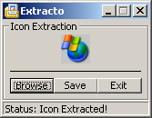



## Extracto

### Description

Extracto is an Icon Extraction Tool. Open an Icon from any Program and save in a variety of formats! Quick and easy. Please vote!
 
### More Info
 

             |
---                |---
**Submitted On**   |2003-03-24 07:04:36
**By**             |[Frequency](https://github.com/Planet-Source-Code/PSCIndex/blob/master/ByAuthor/frequency.md)
**Level**          |Intermediate
**User Rating**    |4.3 (13 globes from 3 users)
**Compatibility**  |VB 5\.0, VB 6\.0
**Category**       |[Complete Applications](https://github.com/Planet-Source-Code/PSCIndex/blob/master/ByCategory/complete-applications__1-27.md)
**World**          |[Visual Basic](https://github.com/Planet-Source-Code/PSCIndex/blob/master/ByWorld/visual-basic.md)
**Archive File**   |[Extracto177792842004\.zip](https://github.com/Planet-Source-Code/frequency-extracto__1-55359/archive/master.zip)

